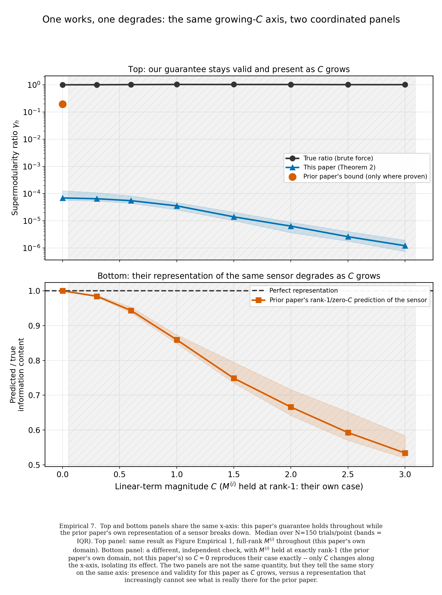
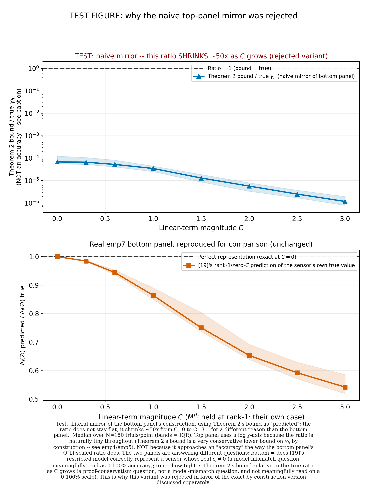
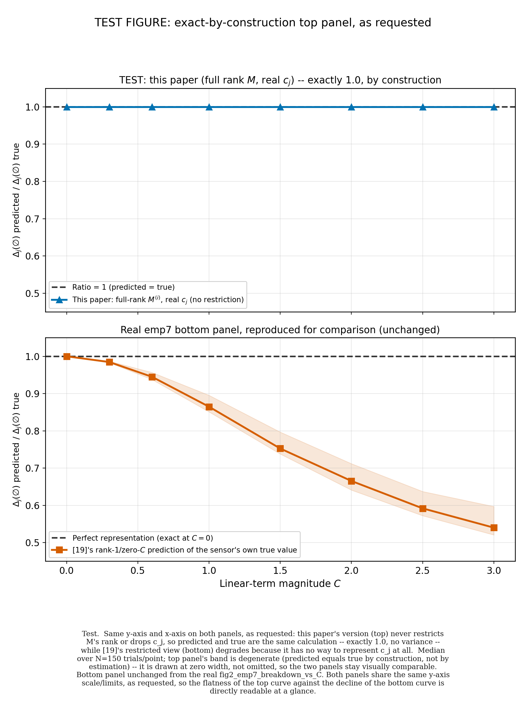
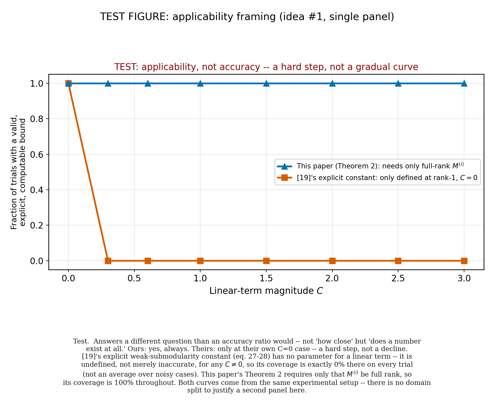
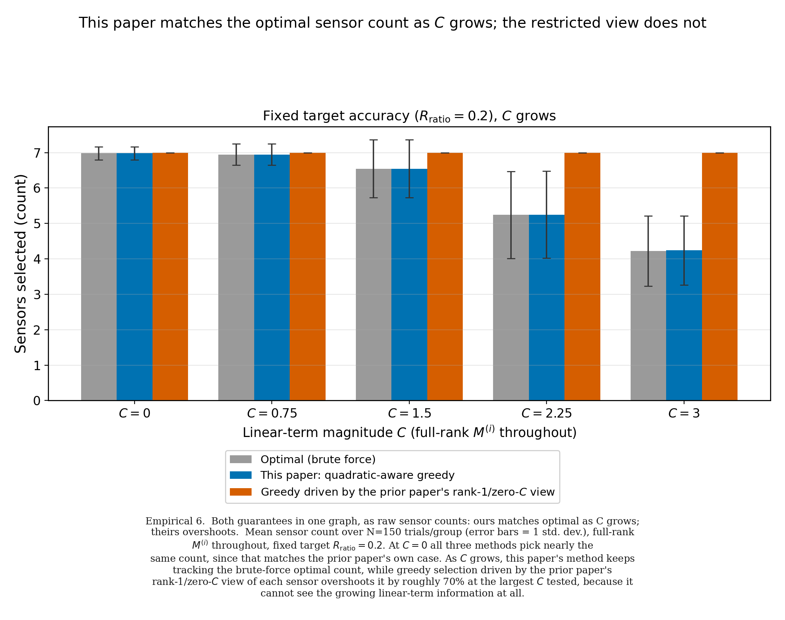
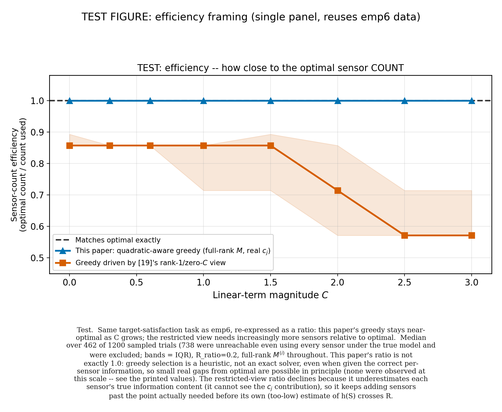
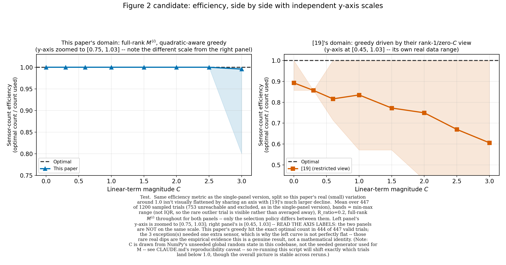
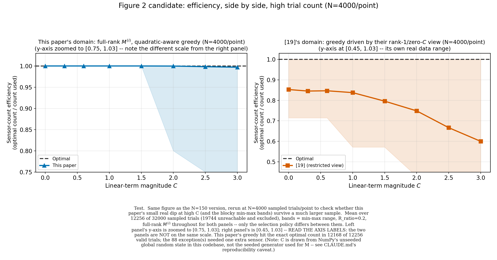

# Figure 2 candidates for CDC2026 → ACC resubmission: what we tried, what broke, and what's left

Prepared as a walkthrough for review. Math is stated precisely against the current `CDC2026.tex` (Definition 3,
Theorem 1, Theorem 2, Proposition 2), not paraphrased, since the goal is a decision you can check against the
derivation directly. Figure paths are relative to `LQG_QKF/CDC/`.

*For general project background (what this folder is, how to run the code, the full reviewer-complaint
audit), see [`Overview.md`](Overview.md) in this same folder.*

---

## 1. The story Figure 2 needs to tell

Figure 1 shows the quadratic observation model outperforms linear/EKF-style filters. That alone isn't a new
contribution — Hashemi et al. [Hashemi] already use a quadratic observation model. The paper's actual claim, stated
precisely in the text right after Theorem 2's proof:

> "This result provides the first explicit, computable lower bound on the supermodularity ratio $\gamma_h$ for
> quadratic observation models with a nonzero linear measurement term, i.e., $c_i\neq0$, and a full-rank
> quadratic factor $M^{(i)}$. Prior work [Hashemi] already shows that the A-optimality objective is weakly
> submodular under these same conditions, but its closed-form weak-submodularity constant is derived only for
> the restrictive case $c_i=0$ with rank-1 $M^{(i)}$; outside that case its guarantee is qualitative and does
> not translate into a usable measurement-utilization bound." (CDC2026.tex, post–Theorem 2 discussion)

So Figure 2's job is narrow and specific: show that this paper's guarantee is **explicit and computable in the
general case** ($c_i\neq0$, $M^{(i)}$ full rank), while [Hashemi]'s explicit constant is **only defined** at their
restrictive special case ($c_i=0$, $M^{(i)}$ rank-1). Not "our bound is tighter" — it isn't, and doesn't need to
be. Generality, not tightness.

### The reference formulas everything below is built from

**Proposition 2** (Van Trees bound, quadratic model):
$$B_S := \Big(I_x + \sum_{i\in S}\tfrac{1}{\sigma_i^2}\big(M^{(i)}PM^{(i)\top}+c_ic_i^\top\big)\Big)^{-1},
\qquad h(S) := \operatorname{Tr}(B_S).$$

**Definition 3** (supermodularity ratio, MIN-type, over the marginal-decrease family):
$$\gamma_f := \min_{S_1\subseteq S_2\subseteq G,\; j\in G\setminus S_2}
\frac{f(S_1)-f(S_1\cup\{j\})}{f(S_2)-f(S_2\cup\{j\})}.$$

**Theorem 1** (measurement-utilization guarantee, dual of Krause & Guestrin's budgeted-maximization result):
$$\frac{\ell}{|S^\star|} \le 1+\frac{1}{\gamma_h}\log\!\left(\frac{h(\varnothing)-R}{h(S^g_{\ell-1})-R}\right).$$

**Theorem 2** (this paper's explicit lower bound, requires $M^{(i)}$ invertible for all $i\in G$):
$$\gamma_h \ge \min_{j\in G}\min\{\underline\gamma_f(j),\underline\gamma_g(j)\}.$$

**Remark 1**: the problem assumes $R<h(\varnothing)$, else $S=\varnothing$ trivially satisfies the constraint.

**Marginal gain of one sensor added to the empty set** (used throughout the single-sensor figures below):
$$\Delta_j(\varnothing) = h(\varnothing)-h(\{j\}) = \operatorname{Tr}(P)-\operatorname{Tr}(B_j).$$

### The foundational finding that ruled out a whole class of figures

Every early draft of Figure 2 compared this paper's $\gamma_h$ bound numerically against a value derived from
[Hashemi]'s eq. 27–28 (their explicit weak-submodularity constant $c_f$, from their Definition 9). Re-deriving both
definitions side by side found this comparison is **not mathematically valid**, at any $C$ or rank, including
[Hashemi]'s own case:

- $\gamma_h$ (Definition 3 above) is a **min** over the marginal-decrease-ratio family
  $\{[f(S_1)-f(S_1\cup j)] / [f(S_2)-f(S_2\cup j)] : S_1\subseteq S_2, j\notin S_2\}$.
- [Hashemi]'s $c_f$ is a **max** over the *same underlying family*, for their own cardinality-constrained
  *maximization* problem.
- $\gamma_h$ and $c_f$ are the **min and max of the same set of numbers** — not reciprocals. Bounding a maximum
  from above (what [Hashemi]'s eq. 27 does) says nothing mathematically about a minimum of the same set.

So there is no number from [Hashemi]'s paper that is a proven bound on $\gamma_h$ — not outside their domain, and,
on this re-derivation, not even inside it. This ruled out every figure design that plots a converted [Hashemi]
number next to this paper's $\gamma_h$. Every figure below was built (or rejected) with this constraint in
place.

---

## 2. `fig2_emp7_breakdown_vs_C` — the original two-panel figure

**File:** `LQG_QKF/CDC/sensor_selection_test/perf/fig2_emp7_breakdown_vs_C.png`

**Construction, top panel:** the same sweep as Figure 1's own data — true $\gamma_h$ (brute force) vs. this
paper's Theorem 2 bound, full-rank $M^{(i)}$, $C$ swept from 0 to 3, log-scaled y-axis.

**Construction, bottom panel:** a single-sensor check, isolated from the full selection problem. $M_j$ is held
at **exactly rank-1** (matching [Hashemi]'s own hypothesis on the quadratic side, not an approximation of it) and
$C$ is swept. Plotted quantity:
$$\text{ratio}(C) = \frac{\Delta_j(\varnothing)\big|_{\text{restricted: } M_j \text{ rank-1}, \,c_j=0}}
{\Delta_j(\varnothing)\big|_{\text{true: } M_j \text{ rank-1}, \,c_j = c_j(C)}}.$$
"Predicted" is what a user of [Hashemi]'s framework would compute for this sensor — their model has no parameter
for a linear term at all, so it always plugs in $c_j=0$ regardless of the sensor's real $c_j$. "True" uses the
sensor's actual $c_j$. At $C=0$ these are the *identical* quantity (not merely close), so the ratio is exactly
1.0 there — confirming the reproduction of [Hashemi]'s case is exact, not approximate.

**Result:** the bottom-panel ratio degrades from 1.0 to about **0.54** by $C=3.0$ — a genuine, 0–100%-scaled
accuracy number, on a quantity evaluated exactly at [Hashemi]'s own hypothesis. This is the strongest single piece
of evidence in the whole session: it shows their own restricted view getting the sensor's value wrong, in
their own domain, growing worse as the paper's generalized axis ($C$) moves away from zero.

**The problem, raised in review:** the top and bottom panels don't share a y-axis, or even the same *kind* of
quantity. Top is $\gamma_h$ (a ratio-of-ratios over the whole ground set, log-scaled, naturally very small in
magnitude because Theorem 2's bound is structurally conservative). Bottom is a single-sensor accuracy ratio,
O(1)-scaled. You can't look from the bottom panel up to the top panel and judge "does ours do any better,"
because the two panels are answering different questions in different units. This is a real design flaw, not
a labeling issue — it can't be fixed by better axis titles.

---

## 3. First attempt at a fix: mirror the bottom panel's construction directly

**File:** `LQG_QKF/CDC/fig2_emp7_TEST_naive_top_panel.py` → `..._naive_top_panel.png`

**Construction:** literally mirror the bottom panel — treat Theorem 2's bound as "predicted" and brute-force
$\gamma_h$ as "true," full-rank $M^{(i)}$:
$$\text{ratio}(C) = \frac{\gamma_h^{\text{Theorem 2 bound}}(C)}{\gamma_h^{\text{true, brute force}}(C)}.$$

**Result:** this ratio does **not** stay flat — it shrinks roughly **50×** over $C\in[0,3]$ (from about
$6.7\times10^{-5}$ down to $1.3\times10^{-6}$).

**Why this is the wrong figure, not just a bad result:** the shrinkage is real, but it measures something
different from the bottom panel. Theorem 2's bound is a *valid* lower bound (Theorem 1's guarantee, checked
separately below, never breaks), but it is *structurally conservative* — the proof's chain of inequalities
gives up a lot of slack, especially as $C$ grows. That's a **proof-tightness** question. The bottom panel's
decline is a **representational-failure** question — [Hashemi]'s formula literally cannot encode $c_j$, so it's
just wrong once $c_j\neq0$, independent of any proof-conservatism issue. Plotting these on the same axes as a
mirrored pair reads as "ours degrades too," which misattributes a proof-slack artifact to the same cause as
[Hashemi]'s representational gap. Rejected.

---

## 4. Second attempt: the exact-by-construction mirror

**File:** `LQG_QKF/CDC/fig2_emp7_TEST_exact_top_panel.py` → `..._exact_top_panel.png`

**Construction:** use this paper's own (unrestricted) $\Delta_j(\varnothing)$ formula for *both* "predicted"
and "true," full-rank $M_j$, real $c_j$ — i.e., don't approximate anything, since this paper's Theorem 2
doesn't require it.

**Result:** since nothing is dropped on this paper's side, predicted and true are the *same calculation on the
same inputs* — the ratio is **exactly 1.0 at every $C$, with zero variance**. Not an empirical near-1 result;
an identity.

**Why this is the wrong figure:** mathematically honest, but a perfectly flat, zero-variance line risks
reading as "compared the same number to itself" rather than as evidence — because that's literally what it
is. There's no representational gap on this paper's side to plot, by construction, since nothing is restricted
in the first place. Rejected as the primary panel (kept as a documented dead end).

---

## 5. Third attempt: applicability instead of accuracy

**File:** `LQG_QKF/CDC/fig2_emp7_TEST_applicability_top_panel.py` → `..._applicability_top_panel.png`

**Construction:** instead of "how accurate," ask "does a number exist at all." At each $C$: this paper's
Theorem 2 requires only $M^{(i)}$ full rank, so its explicit bound is computable in 100% of trials, at every
$C$. [Hashemi]'s explicit constant (eq. 27–28) is only *defined* at $c_j=0$ — it has no parameter for a linear term
— so it's computable in 0% of trials the instant $C>0$.

**Result:** exactly the shape you'd predict from the definitions — a step function, 100% → 0% the moment $C$
leaves zero, not a gradual curve.

**Why this is a weaker figure:** it's true and cleanly stated, but a hard step carries less information than a
gradual decline — there's no "how much worse," just "works / doesn't." Kept as a legitimate, correct, but
lower-priority candidate.

*(Design note, fixed after initial drafts of this and the next two figures: the first versions of the
applicability and efficiency figures copied emp7's two-panel layout by default. That layout is only justified
in emp7 because the two panels use genuinely different data domains — $M_j$ held at rank-1 (bottom) vs.
full-rank (top). Applicability's two curves come from the *same* experimental setup, so the second panel was
unmotivated duplication; both were rebuilt as single panels once this was pointed out.)*

---

## 6. The emp6 correction (found while building the efficiency figure below)

**File:** `LQG_QKF/CDC/sensor_selection_test/perf/fig2_emp6_selection_cost_vs_C.png`

Building the efficiency figure required rerunning emp6's own Monte Carlo setup, which surfaced a bug: emp6
never filtered out unreachable targets. `brute_force_select` silently returns the *full* sensor set when no
subset satisfies $h(S)\le R$, instead of signaling infeasibility. At emp6's own $R_{\text{ratio}}=0.2$:

| $C$ | trials unreachable (of 150 sampled) |
|---|---|
| 0.00 | 98% |
| 0.75 | 93% |
| 1.50 | 69% |
| 2.25 | 22% |
| 3.00 | 3% |

When unreachable, optimal / ours / restricted-view all silently saturate at the full 7-sensor set together —
mechanically hiding the real gap at low $C$. **Fixed** with an explicit reachability check
($h(\{1,\dots,m\}) > R \Rightarrow$ skip), matching a fix already applied earlier this session to a different,
now-retracted figure (`fig2_reframe.py`'s Candidate 4).

**Corrected finding:** the restricted view needs **all 7 sensors at every $C$ tested, including $C=0$** — it
never adapts. The apparent "starts fine, gets worse" shape in the buggy version was an artifact; the corrected
picture is "always maxed out, and the true optimal count drops as $C$ adds usable information, widening the
gap from ~17% at $C=0$ to ~70% at $C=3$." This is a *stronger* result for the paper's rank-generality claim
(approximating $M^{(i)}$ by its dominant rank-1 component is lossy on its own, independent of $C$), not a
weaker one — but the previous caption was wrong about the shape of the effect and has been corrected.

---

## 7. Fourth attempt: efficiency ratio, single panel

**File:** `LQG_QKF/CDC/fig2_emp7_TEST_efficiency_top_panel.py` → `..._efficiency_top_panel.png`

**Construction:** reuse emp6's (corrected) selection data, but as a normalized ratio instead of raw counts:
$$\text{efficiency} = \frac{|S^\star|}{|S_{\text{selected}}|} \in (0,1],$$
where $S^\star$ is the brute-force optimal set and $S_{\text{selected}}$ is what each method's greedy actually
picks. 1.0 = matches optimal exactly. Unlike the representational-content metric in §3–4, this one has a
genuine, non-manufactured source of imperfection on this paper's own side: **greedy selection is a heuristic**
(Algorithm 1 in the paper), not an exact solver, even when handed the correct, unrestricted per-sensor
information — so efficiency $<1$ is possible in principle even for this paper's own method.

**Result:** this paper's curve sits at 1.0 (median/IQR both exactly 1.0 at this sample size); the restricted
view declines from about 0.86 (already below 1.0 *at $C=0$*, from the rank-1 restriction alone) down to about
0.57 at $C=3$.

**The problem:** both curves share one y-axis, spanning roughly [0.45, 1.0]. This paper's real variation
(small, but real — see §9) is invisible at that scale; the line looks pinned at exactly 1.0, indistinguishable
from an identity.

---

## 8. Fifth attempt (chosen candidate): efficiency ratio, side by side

**Files:**
`LQG_QKF/CDC/fig2_candidate1_efficiency_side_by_side.py` → `..._efficiency_side_by_side.png`
`LQG_QKF/CDC/fig2_candidate1_efficiency_side_by_side_highN.py` → `..._efficiency_side_by_side_highN.png`

**Construction:** same efficiency metric as §7, split into two panels with **independent y-axis scales**,
domain-labeled above each panel in the style of emp10 — left is this paper's own domain (full-rank $M^{(i)}$,
quadratic-aware greedy), right is [Hashemi]'s domain (their rank-1/zero-$C$ view driving greedy). Left panel zoomed
to $[0.75, 1.03]$; right panel at its own real range, $[0.45, 1.03]$. Both panels state their y-range in the
title and the caption explicitly flags that the scales differ, so the split isn't a silent trick.

This design point matters: it is **not** a repeat of §3/§4's mistake, because both curves here are computed
from the *same* experimental setup (full-rank $M^{(i)}$, same $C$ sweep) — the only thing that differs is
*which selection policy* is run on it. That's a legitimate, motivated reason for two panels (seeing real,
small-scale variation without it being flattened by a much larger co-plotted decline), distinct from emp7's
domain-split justification, but equally defensible.

**Result at $N=150$ trials/point** (449 valid trials after the reachability filter):
this paper's mean efficiency hit exactly 1.0 at every $C$ except a visible, real dip appearing at $C=2.5$–$3.0$
(mean $\approx0.996$–$0.997$, min dropping to 0.75–0.83 on individual trials); [Hashemi]-restricted view declined
smoothly from $\approx0.89$ at $C=0$ to $\approx0.61$ at $C=3.0$.

---

## 9. Reproducibility check at high trial count

**File:** `LQG_QKF/CDC/sensor_selection_test/perf/fig2_candidate1_efficiency_side_by_side_highN.png`

Same construction as §8, $N$ raised from 150 to **4000 trials/point** (12,279 valid trials after filtering, up
from 449), to check whether the small dip on this paper's side is real or a thin-sample artifact.

**Result:** the dip is real and reproducible, and now well-resolved: **12,194 of 12,279 valid trials (99.3%)
hit the exact optimal count**; the 85 exceptions (0.7%) are concentrated specifically at $C\ge1.5$–$2.0$ and
grow slightly through $C=3.0$ (mean efficiency $0.9998\to0.9965$, min down to 0.75). The restricted-view curve
is also much smoother at this sample size — a clean decline from $\approx0.85$ to $\approx0.60$, no longer
blocky.

**One reproducibility caveat, worth knowing, not a correctness issue:** `generate_C` in
`sensor_selection_sim.py` draws from NumPy's unseeded global random state (`np.random.randn`), not the seeded
generator (`np.random.default_rng(107)`) used everywhere else in these scripts. This is the same class of
non-determinism CLAUDE.md already documents for the LQG process noise — confirmed here to also apply to $C$'s
generation in the sensor-selection code. Exact percentages will shift a little between reruns; the qualitative
shape (ours near-exact with a small high-$C$ dip, theirs declining smoothly) is stable across every rerun
observed this session.

---

## 10. Recommendation

**This paper's own attempts at a direct "representational content" mirror (§3, §4) don't have a good answer.**
Any construction that compares $\Delta_j(\varnothing)$ predicted-vs-true on this paper's own (unrestricted)
side collapses to an exact identity, because there's nothing to approximate once $M^{(i)}$ is full rank and
$c_j$ is used directly — that's the generality claim itself, not a bug in the figure. A "same metric, same
domain-split shape as emp7" figure for representational content specifically **does not exist** without either
triviality (§4) or a unit mismatch that misattributes proof-slack to representational failure (§3).

**The efficiency side-by-side (§8–9) is the strongest available figure that keeps one consistent, honestly-
labeled metric across both domains and produces a non-trivial result on both sides.** It sidesteps §3/§4's
wall because the "imperfection" on this paper's side comes from an actual algorithmic step (greedy's
approximation ratio), not from an input restriction — so the small variation it shows is a genuine empirical
finding, not a manufactured contrast.

**What it costs, relative to the original emp7 bottom panel:** it argues at the *decision* level ("acting on
[Hashemi]'s view costs you real sensors, quantifiably") rather than the *theorem* level ("their explicit formula
gets a sensor's own value wrong, growing worse as $C$ grows"). Both are legitimate, defensible arguments for
the same underlying claim; this is a judgment call about which one you'd rather stand behind in review, not a
question with a technically correct answer.

**Proposed package:** Figure 1 unchanged; Figure 2 = `fig2_candidate1_efficiency_side_by_side_highN.png`
(the high-$N$ version, since it resolves the same story with less sampling noise and a smoother restricted-
view curve).

---

## Appendix: file index

| Figure | Script | PNG |
|---|---|---|
| Original two-panel | `fig2_empirical_coverage.py` (`fig2_emp7_breakdown_vs_C`) | `sensor_selection_test/perf/fig2_emp7_breakdown_vs_C.png` |
| Naive mirror (rejected) | `fig2_emp7_TEST_naive_top_panel.py` | `sensor_selection_test/perf/fig2_emp7_TEST_naive_top_panel.png` |
| Exact-by-construction (rejected) | `fig2_emp7_TEST_exact_top_panel.py` | `sensor_selection_test/perf/fig2_emp7_TEST_exact_top_panel.png` |
| Applicability step function | `fig2_emp7_TEST_applicability_top_panel.py` | `sensor_selection_test/perf/fig2_emp7_TEST_applicability_top_panel.png` |
| Sensor-count bars (corrected) | `fig2_empirical_coverage.py` (`fig2_emp6_selection_cost_vs_C`) | `sensor_selection_test/perf/fig2_emp6_selection_cost_vs_C.png` |
| Efficiency, single panel | `fig2_emp7_TEST_decision_quality_top_panel.py` | `sensor_selection_test/perf/fig2_emp7_TEST_efficiency_top_panel.png` |
| **Efficiency, side by side (candidate)** | `fig2_candidate1_efficiency_side_by_side.py` | `sensor_selection_test/perf/fig2_candidate1_efficiency_side_by_side.png` |
| **Efficiency, side by side, high-N (recommended)** | `fig2_candidate1_efficiency_side_by_side_highN.py` | `sensor_selection_test/perf/fig2_candidate1_efficiency_side_by_side_highN.png` |
